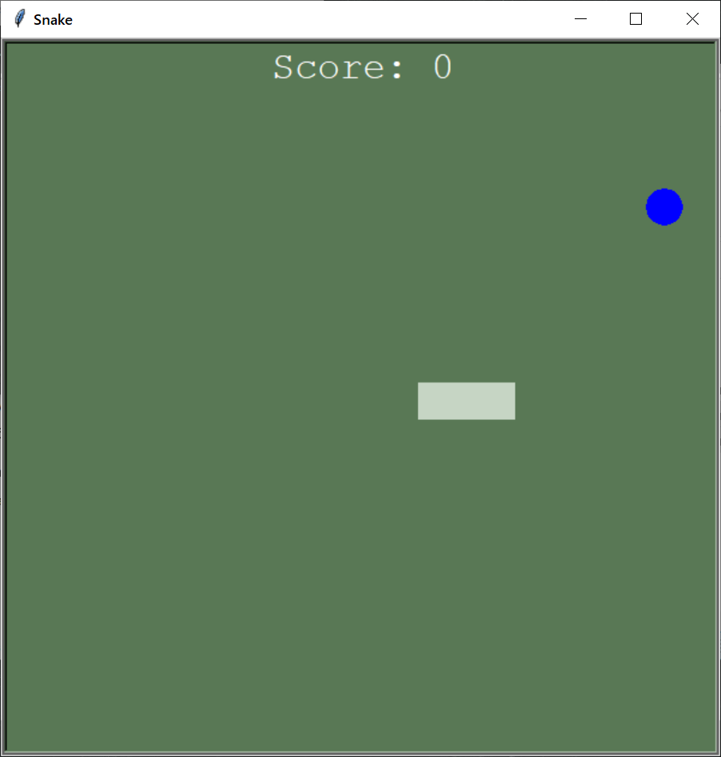
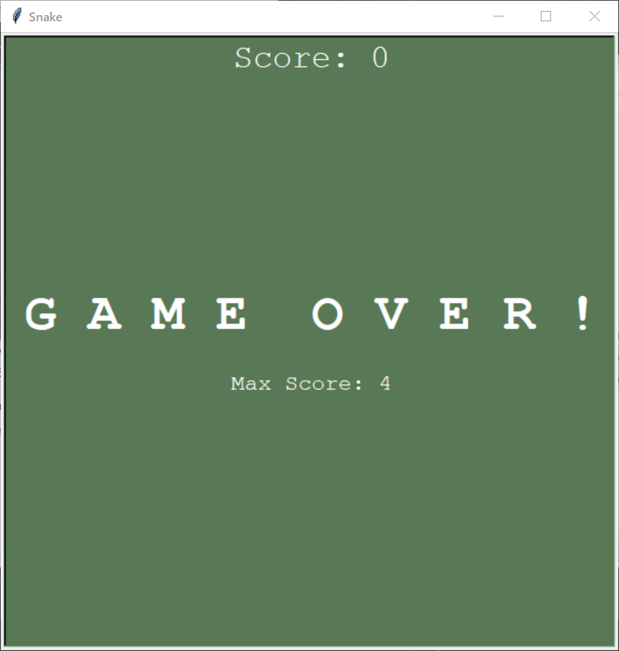

<h1 align="center">Simple Snake</h1>

 

  

  
  
  
  
  
  

  

_Простенькая змейка с грфическим модулем Turtle_

---
Управление в игре осуществляется стрелками на клавиатуре.

<h1 align="center">Скриншоты игры</h1>

  
  

# Содержание проекта

| Модуль       | Класс    | Описание                       |
| ------------ | -------- | -------------------------------|
| `sprites`    | Snake    | Полное управление змейкой      |
| `sprites`    | Food     | Обновление и перемещение снэка |
| `scoreboard` | Board    | Рекорды сохраняются в txt-файл |
| `game      ` | MainLoop | Главный игровой цикл           |
